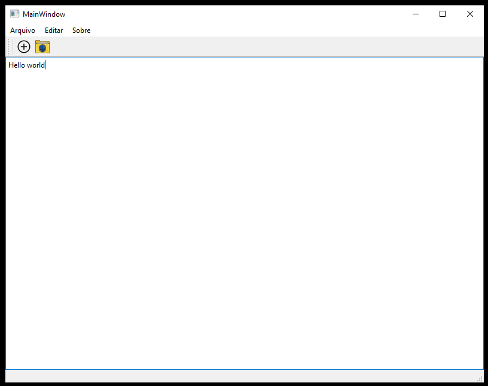

# Bloco de Notas - Projeto em C++ com Qt

Este é um projeto de **Bloco de Notas** desenvolvido em C++ utilizando o framework Qt. O objetivo deste projeto é criar uma aplicação simples de editor de texto, permitindo ao usuário abrir, editar, salvar arquivos de texto e realizar funções básicas de formatação.

## Funcionalidades

- Criar, abrir e salvar arquivos de texto.
- Funcionalidades de edição como copiar, colar e recortar.
- Suporte a múltiplos formatos de arquivos de texto.
- Interface gráfica intuitiva utilizando Qt Widgets.

## Tecnologias Utilizadas

- **Linguagem:** C++
- **Framework:** Qt
- **IDE:** Qt Creator
- **Bibliotecas:** QtCore, QtGui, QtWidgets

## Como Rodar o Projeto

### Pré-requisitos

- **Qt Framework** instalado. Você pode fazer o download [aqui](https://www.qt.io/download-dev).
- **Qt Creator** como IDE.
- **Compilador C++** compatível (como MinGW ou MSVC).

### Instruções de Execução

1. **Clonar o repositório:**
   ```bash
   git clone https://github.com/usuario/projeto-bloco-de-notas.git
   ```

2. **Abrir o projeto no Qt Creator:**
- Abra o Qt Creator.
- Clique em Abrir Projeto e selecione o arquivo .pro ou .cpp do projeto clonado.

3. **Configurar Kit de Construção:**
- Selecione o kit de compilação que você deseja usar (por exemplo, MinGW ou MSVC).

4. **Compilar o projeto:**
- Clique em **Build** > **Build** Project ou pressione **Ctrl + B** para compilar o projeto.

5. **Executar o projeto:**
- Após a compilação, clique em Run ou pressione **Ctrl + R** para rodar a aplicação.

# Estrutura do Projeto

```bash

├── README.md          # Este arquivo
├── main.cpp           # Arquivo principal
├── mainwindow.cpp     # Implementação da interface gráfica
├── mainwindow.ui      # Layout da interface gráfica
├── Notepad.pro        # Arquivo de configuração do Qt Project
└── resources/         # Recursos (ícones, imagens)
```

# Imagens



# Contribuição

Se você quiser contribuir com o projeto, siga os passos abaixo:

- Faça um fork do projeto.
- Crie uma nova branch com suas melhorias.
- Envie um Pull Request com uma descrição detalhada.

# Licença

Este projeto está sob a licença MIT.


